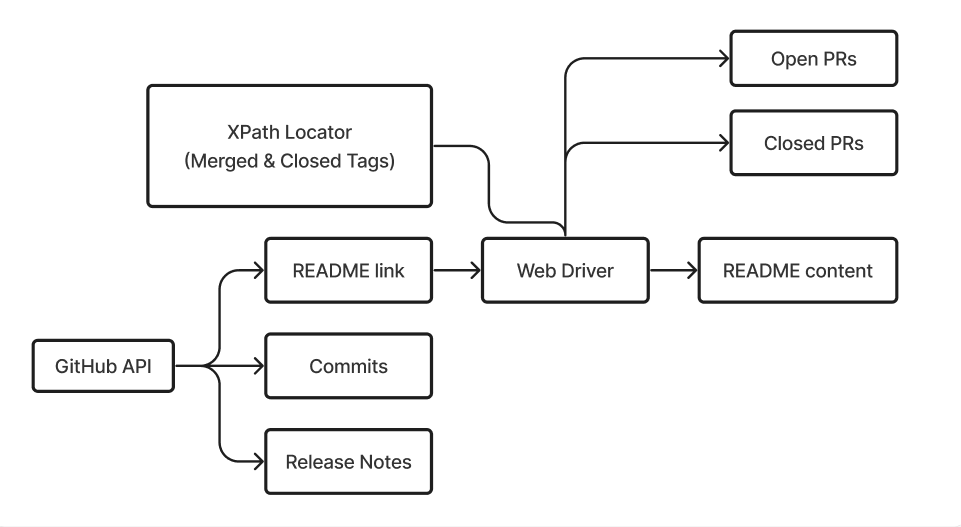
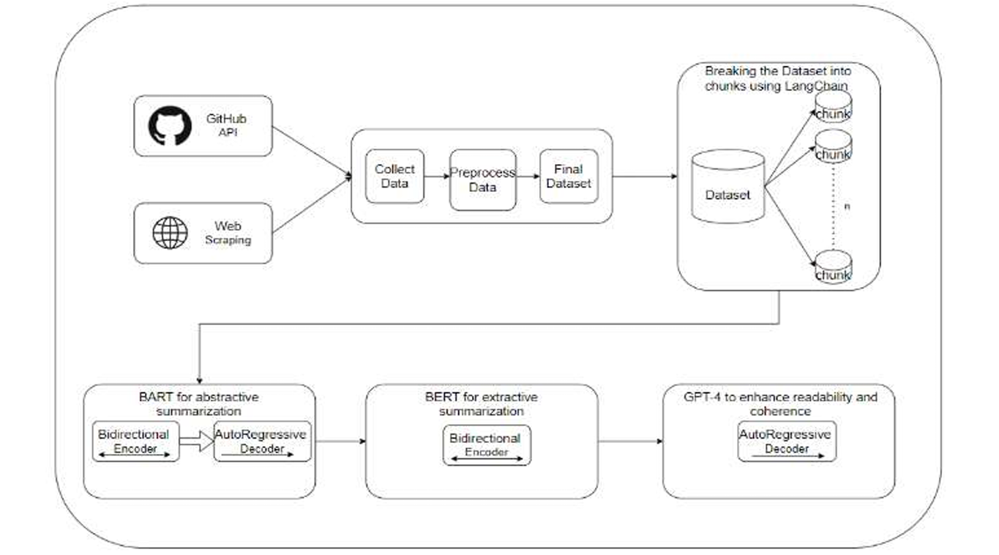
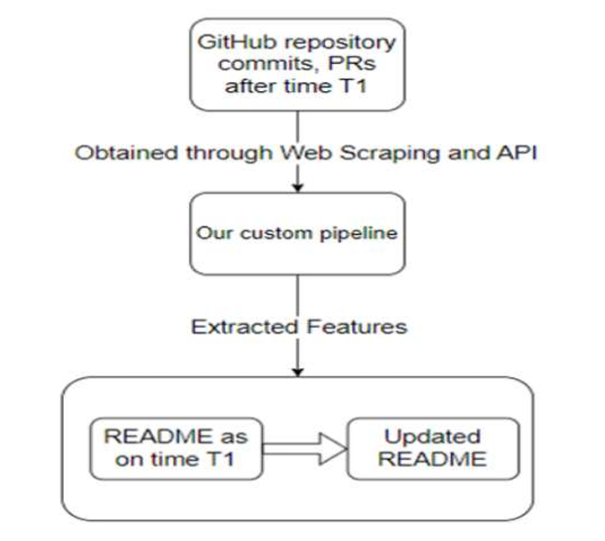
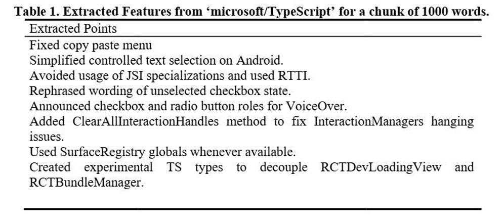

# AutoCAF: Automated Feature Extraction from Control Artifacts in GitHub Repositories

## Project Overview

This repository implements the methodology presented in the research paper _"Automated Feature Extraction from Control Artifacts in GitHub Repositories"_ published in the Journal of Electrical Systems.

The project focuses on parsing and semantically embedding control artifacts from GitHub repositories. Control artifacts — such as GitHub Actions workflows, Dockerfiles, shell scripts, YAML configurations, and other CI/CD-related files — often contain critical information about the operational behavior of software projects. However, they are typically ignored or underutilized in repository mining efforts.

This work introduces a systematic approach to detect these files, analyze their structure, and extract meaningful vectorized representations that can be used for downstream tasks such as repository classification, CI/CD intent modeling, or pipeline recommendation systems.

## Motivation

Modern software repositories increasingly rely on automation, yet research tools and models tend to prioritize application source code over the operational logic embedded in control artifacts. This leaves a gap in how we understand repository behavior, software maturity, and engineering practices. Our approach fills this gap by treating control artifacts as first-class citizens in repository mining.

By automating the extraction of features from these artifacts, we aim to make it easier to conduct large-scale studies on automation usage, detect anti-patterns, or even generate intelligent suggestions for workflow design.

## Core Components

The pipeline implemented in this repository follows these main phases, each designed to work independently or as part of a unified processing flow:

### Artifact Detection

We start by identifying relevant control artifacts in a given GitHub repository. This includes:
- YAML or JSON files under `.github/workflows`, `.circleci/`, `.gitlab-ci.yml`, etc.
- Dockerfiles or container build scripts
- Shell scripts and automation tools like `Makefile`, `Jenkinsfile`, etc.

File detection is performed using a combination of file-path heuristics and pattern-based filters.



### Preprocessing

Once the relevant files are identified, they are preprocessed to normalize variations and reduce noise. This step may include:
- Token normalization (e.g., replacing hardcoded variables with placeholders)
- Removal of comments and environment-specific tokens
- Standardization of control structures (loops, conditions, triggers)

This makes the artifacts easier to model across projects.

### Feature Extraction

The cleaned control artifacts are then transformed into numerical representations using multiple strategies, including:
- Token frequency (bag-of-operations)
- Structural metadata (steps, triggers, runners, containers)
- Language model embeddings (from models pretrained on code/configuration)
- Graph-based representations (for control/data flow structure)

These features are concatenated or used individually depending on the task (e.g., classification, clustering, similarity retrieval).

### Output

The final output is a matrix of feature vectors — one per artifact — suitable for integration with machine learning pipelines. These embeddings can be used for:
- Repository-level classification (e.g., maturity level, DevOps intent)
- Visualization and clustering of automation strategies
- Recommender systems for workflow templates

## System Architecture



## Applications

This framework can be used for a range of practical applications such as:
- Analyzing automation usage trends across open-source ecosystems
- Building developer tools that offer recommendations for CI/CD workflows
- Detecting anti-patterns or misconfigurations in pipeline definitions
- Bootstrapping datasets for large-scale CI/CD research

## Software Engineering Pipeline

In a typical software development lifecycle, developers push hundreds of commits and open dozens of pull requests, each containing varying levels of information about changes to the codebase. Over time, this creates a massive trail of low-level logs that are rarely easy to digest. Our system is designed to address that exact problem by acting as a semantic filter and summarization layer that sits between version control and documentation.

The pipeline begins by scanning a repository for control artifacts such as workflow files, CI/CD scripts, and deployment configurations. Alongside these files, it also ingests commit messages and pull request metadata. Using a combination of natural language processing techniques and rule-based heuristics, it identifies the meaningful parts of this textual data, filtering out boilerplate messages and extracting semantically rich insights about what was changed, why it was changed, and how it impacts automation.

These extracted insights are then summarized into readable text that captures the essence of the development activity. What makes this powerful is that the summaries aren't generic — they’re tied directly to configuration files and automation logic, meaning they offer a contextual snapshot of how the infrastructure is evolving. This summary can then be automatically embedded into a repository’s README or changelog, effectively documenting the repository’s operational maturity without requiring any manual input from developers.

By integrating this into a developer's workflow, the system enables repositories to become more self-explanatory, reduces onboarding time for new contributors, and gives maintainers an easy way to keep their documentation up to date with evolving CI/CD practices.



## Results

We tested our system on a large number of public repositories, including well-maintained ones like `microsoft/TypeScript`, to evaluate how well it could extract meaningful, human-readable summaries from commit and PR histories.

In one such example, we processed a 1,000-word chunk of commit-related data and extracted the most significant engineering changes. Instead of raw commit messages, the system produced a concise and structured summary of development activity. It highlighted changes like the fixing of the copy-paste menu, simplification of text selection behavior on Android, rephrasing of checkbox labels, enhancements to accessibility through VoiceOver role announcements, and the addition of methods like `ClearAllInteractionHandles` to address hanging issues. It also identified the introduction of experimental TypeScript types and the usage of SurfaceRegistry globals — insights that are typically buried deep in a noisy commit log.

These results show that the system doesn't just summarize content — it understands structure and intent. It turns an overwhelming stream of fragmented developer messages into a coherent narrative that can be used to document automation changes, inform stakeholders, and make repositories more transparent. For projects with active DevOps pipelines, this means less time spent deciphering logs and more time focusing on actual engineering decisions.



## Publication

This work was published in the **Journal of Electrical Systems** indexed in Scopus.

## Citation

Please cite the original paper if you use this project or build on top of it:

```bibtex
@article{vaghulade2024automated,
  title        = {Automated Feature Extraction from Version Control Artifacts in GitHub Repositories},
  author       = {Vaghulade, Maitreya and Dalal, Urav and Fargose, Sean and Shah, Devang and Maniar, Kush and Bhowmick, Kiran and Narvekar, Meera},
  journal      = {Journal of Electrical Systems},
  volume       = {20},
  number       = {10s},
  pages        = {8246--8252},
  year         = {2024},
  month        = jul,
  doi          = {10.52783/jes.7091},
  url          = {https://doi.org/10.52783/jes.7091}
}
```
## Contact

For questions, suggestions, or collaborations, feel free to open an issue or reach out via maitreya.vaghulade@gmail.com
